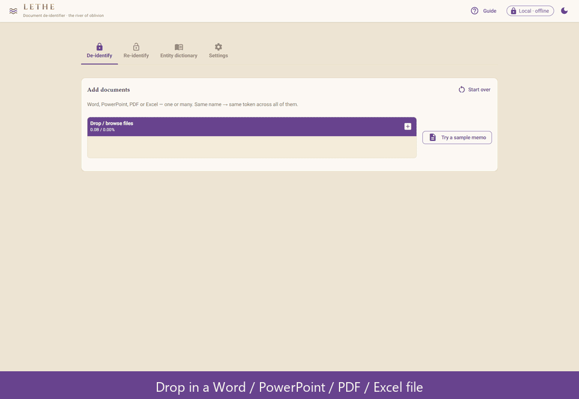

<p align="center">
  
</p>

<h1 align="center">Lethe</h1>

<p align="center">
  A <b>fully-local, reversible</b> document de-identifier — strip the names out of a
  document <i>before</i> you send it to an AI, then put them back into the AI's reply.
  Nothing ever leaves your machine: no cloud, no API key, no internet call.
</p>

<p align="center">
  
</p>

---

## The problem

You want to use AI on your work — summarise a deal memo, review a contract, draft a
reply, sanity-check a model. But the document is **confidential**: it names clients,
counterparties, deal parties, employees. Pasting it into ChatGPT, Claude or any
third-party AI would send those names to an outside service — a breach of client
confidentiality, your firm's data policy, or an NDA.

So you're caught between two things you both want:

> *"The AI could genuinely help with this… but I can't let it see who's involved."*

The usual workarounds are poor: redact by hand (slow, error-prone, and the AI can no
longer tell the parties apart), or just don't use AI at all (and forgo the help).

## Why "Lethe"

In Greek myth, **Lethe** (Λήθη, *"oblivion"*) is one of the five rivers of the
underworld — the **river of forgetfulness**. The shades of the dead drank from it to
forget their former lives before moving on.

The name fits what the tool does: it makes a document **forget who is named in it**
before that document goes to the AI. Unlike the myth, the forgetting is *reversible* —
Lethe restores every real name afterwards.

## How Lethe solves it

Lethe sits between you and the AI as a **local privacy gate**:

1. **De-identify** — Drop in a Word, PowerPoint, PDF or Excel file. Lethe finds the people and
   counterparties (from your dictionary, pattern rules and an optional NLP engine) and
   replaces each with a stable placeholder token — `[PERSON_001]`, `[COUNTERPARTY_001]`.
   You get back a de-identified copy in the **same format**, plus a **Job ID**. The same
   name always maps to the same token, so the document still reads coherently and the AI
   can reason about "[COUNTERPARTY_001]" throughout.
2. **Use the AI freely** — Give the scrubbed document to any AI. It never sees a real
   name, only opaque tokens, so there is nothing confidential to leak.
3. **Re-identify** — Paste the AI's reply back into Lethe with the Job ID; it swaps the
   real names back in. The reply can even be a *different* document — a summary, redraft
   or translation — because Lethe just maps the tokens back to names.

Everything runs on **your machine**. The names you are protecting are never transmitted
anywhere — Lethe has no server side, no API key, no internet call. The reversal key for
each job is encrypted with a passphrase and stored only on your computer.

## Key features

- **Fully local & reversible** — de-identify before the AI sees a document,
  re-identify the AI's reply afterwards. No internet, no telemetry.
- **Entity dictionary (the reliable core):** a curated list of your real people and
  counterparties with their aliases (*Acme Capital Partners* / *Acme* / *ACP*) gives
  near-100% reliability on the names that actually matter. Bulk-paste a master list.
- **NLP suggestions:** Microsoft **Presidio** + **spaCy** detect *possible* names and
  organisations not yet in your dictionary (off by default — you decide). Falls back
  to a lightweight regex name-guesser when the NLP engine isn't installed.
- **Pattern detection:** emails, phone numbers and account numbers out of the box.
- **Stable tokens:** the same name always maps to the same token — consistently
  across every file in a batch.
- **Custom token types:** beyond the built-in PERSON / COUNTERPARTY / OTHER, define your
  own categories in Settings (e.g. `PROJECT`, `FUND`) — they appear in the Type dropdowns
  and tokenise as `[PROJECT_001]`.
- **Format-preserving:** Word stays Word, PowerPoint stays PowerPoint (slides, tables,
  speaker notes and master/layout text are all redacted), Excel stays Excel (formulas
  preserved).
  PDFs are rebuilt as a de-identified Word file (via **pdfplumber**) — **tables become
  real Word tables**, and each source page gets a **`Page N` heading** so downstream
  tools can quote against the *original* PDF pages. The file opens with an **agent-facing
  notice header** instructing readers/AIs to cite by source page and keep the
  `[TOKEN_NNN]` placeholders verbatim.
- **Local OCR for scanned pages:** PDF pages that are scans/figures with no extractable
  text are read with a **fully-local OCR engine** (PDFium + Tesseract via `liteparse` — no
  cloud) and their names detected and redacted like any other text; those pages are marked
  for careful review since OCR isn't perfect. The Windows build **bundles the English
  model so OCR runs fully offline**; any page OCR still can't read is flagged rather than
  silently dropped.
- **Encrypted vault:** each job's token→name map is sealed with your passphrase
  (PBKDF2 → Fernet). Lose the passphrase and that job is unrecoverable *by design*.
- **Review before anything is written:** Lethe shows every proposed redaction,
  highlighted in the document — nothing is changed until you confirm.
- **Multi-language (detection + OCR):** adding a language in Settings (Chinese, Japanese,
  Korean, …) installs both its name-detection model *and* its OCR model, so scanned
  documents in that script are read too. English works offline out of the box; extra
  languages are a one-off online download. Your dictionary works in every language regardless.
- **Themed desktop UI:** a NiceGUI app with a classical light/dark "river of oblivion"
  skin.
- **Ships everywhere:** a Windows installer and portable bundle (no Python needed), or
  `pipx install` on Windows / macOS / Linux.

## Install

| You are… | Install | Run |
|---|---|---|
| **on Windows, non-technical** | download the installer from [Releases](https://github.com/moonlight-lupin/lethe/releases) and run it (per-user, no admin rights) | Start-menu / Desktop shortcut |
| **on Windows / macOS / Linux, with Python 3.10–3.13** | `pipx install "lethe[nlp,ocr] @ git+https://github.com/moonlight-lupin/lethe@v1.1.0"` | `lethe` |
| **lean (no extras, smaller)** | `pipx install "git+https://github.com/moonlight-lupin/lethe@v1.1.0"` | `lethe` |

[pipx](https://pipx.pypa.io) installs Lethe into its own isolated environment and puts a
`lethe` command on your PATH — the cross-platform way to run it on macOS and Linux. Two
optional extras: `[nlp]` adds the Presidio + spaCy suggestion engine and the small English
model (otherwise Lethe falls back to a built-in regex name-guesser), and `[ocr]` adds
fully-local OCR so scanned/image PDF pages are read (otherwise they're flagged, not read).
Either way, running `lethe` opens the app in your browser at `http://localhost:8731`.

> spaCy/Presidio have no Python 3.14 wheels yet, so the `[nlp]` extra requires Python ≤ 3.13.

The Windows installer and portable bundle embed their own Python, so they need **no
Python on the target machine**.

## How it works — the tabs

**1 · De-identify** — Upload one or more files. Lethe lists what it proposes to
redact: ✅ **known entities** (your dictionary), 🔎 **patterns** (email/phone/account),
and ⚠️ **suggestions** (NLP-detected names, off by default). Review the list, tick or
untick, set a **passphrase**, and **Generate** — you get the de-identified file(s) and
a Job ID. *When you hand the file to an AI, ask it to keep any `[TOKEN_NNN]`
placeholders exactly as written.*

**2 · Re-identify** — Paste the AI's reply (or upload it), pick the **Job ID**, enter
the same **passphrase**, and the tokens turn back into the real names. The AI's output
can be a **completely different document** from what you sent — a summary, redraft or
translation — because re-identify just maps tokens back to names; it never needs the
original file. Matching is **exact** (`[PERSON_001]`), so any token the AI altered or
dropped simply won't be restored — glance over the result and check the restored count.

**3 · Entity dictionary** — Your curated people & counterparties. This is what makes
detection dependable; generic "AI name detection" can miss names, a known list does
not. Add aliases so every variant maps to one token; bulk-import a master list.

**4 · Settings** — Download extra detection-language models on demand; define your own
**token types** (e.g. PROJECT, FUND) that appear in the Type dropdowns; toggle the
light/dark theme.

## Architecture

```
app.py  (NiceGUI UI)
   │
   └─►  lethe/   (engine package — no web dependencies)
          core.py            detection + tokenisation + replace / restore
          docio.py           Word / PDF / Excel read & write
          nlp_suggester.py   Presidio + spaCy suggestions (optional)
          vault.py           encrypted, reversible token → name store
          store.py           entity dictionary (entities.json)
          web_static/        bundled theme assets (Cinzel font, favicon)
```

The UI is a thin layer over the `lethe` package; all detection, redaction and storage
logic lives there with no UI coupling. User data — your `entities.json` dictionary,
custom token types and the encrypted `vault/` — lives in a per-user data directory
(`%APPDATA%\Lethe` on Windows, `~/Library/Application Support/Lethe` on macOS,
`~/.local/share/Lethe` on Linux), or wherever `$LETHE_DATA_DIR` points (the Windows
portable bundle sets it to keep data in-folder). It never goes inside the package.

## Limitations

- **The review step is the safety net, not the AI.** The NLP *suggestions* are a
  convenience to help you spot gaps — treat the dictionary as the source of truth and
  always eyeball the review list.
- **OCR covers PDF pages only, and isn't perfect.** Scanned/image-based *PDF pages* are
  read with local OCR (when installed) and marked for review — but poor scans can defeat
  it, and images *inside Word / Excel / PowerPoint files* (logos, signature images,
  pasted screenshots) are never read. Always review flagged pages.
- **PDF page numbers:** the output's `Page N` headings refer to the *original* PDF pages
  (for citation); the Word file's own rendered pagination won't match the source.
- **Text in shapes, text boxes, embedded objects, metadata, comments and tracked
  changes is not read** — these may still carry names. In **PowerPoint**, text inside
  charts and SmartArt is likewise not read.
- In **Word**, a line containing a redacted name keeps its text but may lose fine
  in-line formatting (bold/italic within that line). Correct redaction is prioritised
  over formatting fidelity.
- In **Excel**, only cell *text* is edited — charts, formatting and formulas are
  preserved. Two edge cases: a redacted name that was styled with mixed formatting
  *within a single cell* loses that cell's in-line formatting (the redaction itself is
  still correct), and a name buried in a *formula string literal* (e.g.
  `="Acme " & A1`) isn't caught — rare for de-identification.
- **The passphrase cannot be recovered.** Lose it and the re-identification mapping for
  that job is gone. Keep the Job ID with the document.

## License & credits

Lethe is released under the **[Apache License 2.0](LICENSE)** — use it, modify it,
embed it, commercially or otherwise, with attribution. See [NOTICE](NOTICE) for
third-party components and [CONTRIBUTING.md](CONTRIBUTING.md) for how to contribute
(Apache-2.0 + DCO sign-off).

It builds on Microsoft **[Presidio](https://github.com/microsoft/presidio)** and
**[spaCy](https://spacy.io)** (both MIT-licensed) for name detection. Lethe is not
affiliated with or endorsed by Microsoft or the spaCy project.
